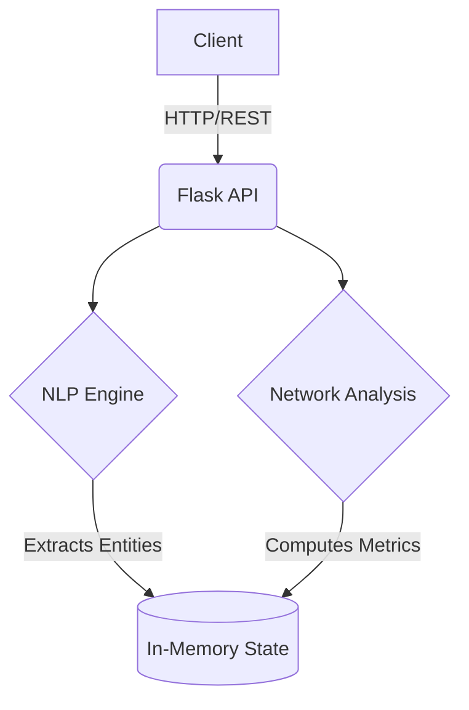

# Criminal Network Analysis System

An advanced platform for extracting and analyzing criminal networks from unstructured reports using NLP.

## Architecture



## Features
- Upload PDF, CSV, JSON reports
- NER extraction for Persons, Organizations, Locations, Phones, Vehicles
- Network visualization using Cytoscape
- Centrality algorithms (Degree, Betweenness, Pagerank)
- Community Detection
- Suspicious Pattern Extraction

## Installation
```bash
pip install -r requirements.txt
```

## Usage
```bash
python app.py
```
Server runs on port 5000. Access endpoints at `http://localhost:5000/api/...`

## Tech Stack
- Flask, NetworkX, Transformers (BERT), Cytoscape.js, Neo4j.
